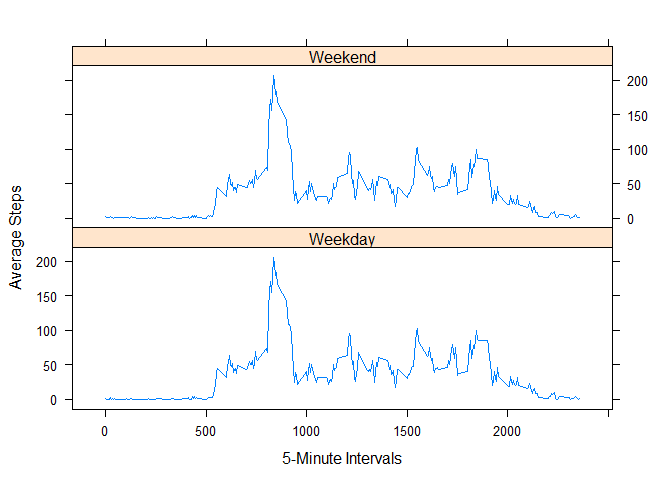

# Reproducible Research: Peer Assessment 1

<br>
<br>

## Loading and preprocessing the data

First you need to set the working directory to that which has a "Data" folder
containing the data file activity.csv, and then you can go ahead and read in the data.


```r
setwd("C:/Users/David/Classes/Coursera/JohnsHopkinsDataScienceSignatureTrack/Reproducible_Research/ProgAssign1")
data <- read.csv("./Data/activity.csv")
```

## Make a histogram of the total number of steps taken each day

First create a data frame that calculates the total number of steps per day


```r
library(plyr)
totalStepsPerDay <- ddply(data, .(date), summarize, dailySteps=sum(steps))
head(totalStepsPerDay,3)
```

```
##         date dailySteps
## 1 2012-10-01         NA
## 2 2012-10-02        126
## 3 2012-10-03      11352
```

Then create the histogram


```r
hist(totalStepsPerDay$dailySteps, col="green", breaks=15, main = "Activity Over 2 Month Period", xlab = "Steps Taken Per Day")
```

 

## What is mean total number of steps taken per day?


```r
mean(totalStepsPerDay$dailySteps, na.rm=T)
```

```
## [1] 10766
```

## What is the median total number of steps taken per day?


```r
median(totalStepsPerDay$dailySteps, na.rm=T)
```

```
## [1] 10765
```

## Create a time series plot of the average number of steps taken (averaged across all days) versus the 5-minute intervals

First make a dataframe with columns "interval" and "avgSteps"


```r
avgPerInterval <- ddply(data, .(interval), summarize, avgSteps=mean(steps, na.rm=T))
head(avgPerInterval, 3)
```

```
##   interval avgSteps
## 1        0   1.7170
## 2        5   0.3396
## 3       10   0.1321
```

Then plot using whatever package you want!


```r
library(ggplot2)
ggplot(avgPerInterval, aes(interval, avgSteps)) + geom_line() + xlab("5-Minute Intervals") + ylab("Average Steps")
```

 

## Which interval average across all days contains the maximum number of steps?


```r
avgPerInterval[which.max(avgPerInterval[,2]),1]
```

```
## [1] 835
```

## Report the total number of rows with NA


```r
sum(is.na(data$steps))
```

```
## [1] 2304
```

## Create a new dataset that is equal to the original but with the missing data filled in (imputed) with the mean for that 5-minute interval

First create the new data set by merging the original data with the data frame created above (containing the average steps per interval) so that all the necessary information is there.


```r
filledData <- merge(data, avgPerInterval)
head(filledData, 3)
```

```
##   interval steps       date avgSteps
## 1        0    NA 2012-10-01    1.717
## 2        0     0 2012-11-23    1.717
## 3        0     0 2012-10-28    1.717
```

Then you can easily impute the interval average for the NA values


```r
filledData$steps <- ifelse(is.na(filledData$steps)==T, filledData$avgSteps, filledData$steps)
```

## Make a histogram of the total number of steps taken each day with this new imputed set.

First create a data frame that calculates the total number of steps per day using the imputed data


```r
totalStepsPerDay2 <- ddply(filledData, .(date), summarize, dailySteps=sum(steps))
head(totalStepsPerDay2, 3)
```

```
##         date dailySteps
## 1 2012-10-01      10766
## 2 2012-10-02        126
## 3 2012-10-03      11352
```

Then create the histogram


```r
hist(totalStepsPerDay2$dailySteps, col="green", breaks=15, main = "Activity Over 2 Month Period (imputed)", xlab = "Steps Taken Per Day")
```

 

## Report the mean total number of steps taken per day with the new imputed data set.


```r
mean(totalStepsPerDay2$dailySteps, na.rm=T)
```

```
## [1] 10766
```

## Report the median total number of steps taken per day with the new imputed data set.


```r
median(totalStepsPerDay2$dailySteps, na.rm=T)
```

```
## [1] 10766
```

## Do these values differ from the estimates from the first part of the assignment? What is the impact of imputing missing data on the total daily number of steps?

Does not seem to be a huge impact

## Create a panel plot comparing the average number of steps taken per 5-minute interval across weekdays and weekends.

Using the imputed data set, first convert the date column from factor to date class


```r
filledData$date <- as.Date(filledData$date)
```

Next add a column with either "Weekend" or "Weekday"


```r
filledData$DAY <- ifelse (weekdays(filledData$date) %in% c("Saturday", "Sunday"), "Weekend", "Weekday")
head(filledData, 3)
```

```
##   interval steps       date avgSteps     DAY
## 1        0 1.717 2012-10-01    1.717 Weekday
## 2        0 0.000 2012-11-23    1.717 Weekday
## 3        0 0.000 2012-10-28    1.717 Weekend
```

Then convert DAY column from a character to a factor variable


```r
filledData$DAY <- factor(filledData$DAY)
```

Finally, make the panel plot


```r
library(lattice)
xyplot(avgSteps ~ interval | DAY, data=filledData, type="l", layout=c(1,2),
       xlab="5-Minute Intervals", ylab="Average Steps")
```

 
